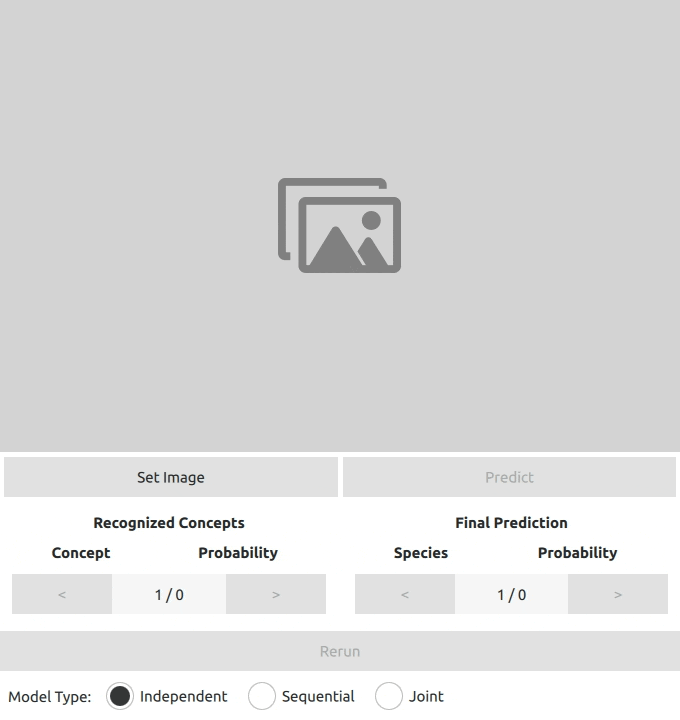
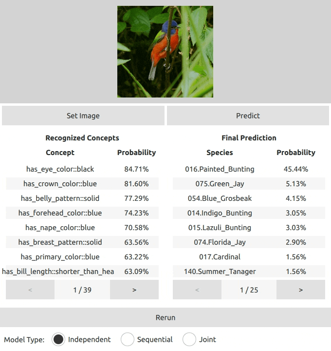

# Interactive Concept Bottleneck Model

CS593HAI Human-AI Interaction programming assignment 2 @Purdue.

## Preview

### Predict



### Rerun



### Change Model


## Getting Started

This project only supports Ubuntu 20.04 or later.

Install Python 3.10.x.

Install Poetry **1.2 or later**. See
[Poetry's documentation](https://python-poetry.org/docs/) for details.

> Poetry earlier than 1.2 will not work with this project.

Install the project's dependencies:

```sh
poetry install --no-root
```

Activate the virtual environment:

```sh
poetry shell
```

Execute the application:

```sh
python main.py
```

> Make sure you are in the project's root directory and your have activated the
> virtual environment.

> We currently only support JPEG images.

## Model Architecture

All model accuracies can be found in [`test_models.ipynb`](./test_models.ipynb). Also, you can find the inference script in [`src/concept_bottleneck/inference.py`](src/concept_bottleneck/inference.py).

### Independent

Accuracy: 45.10%

#### [Image to Concepts](./independent_image_to_attributes.ipynb)

- A pre-trained InceptionV3 model (finetuning)
- Optimizer: SGD
- Learning rate: 0.1
- Momentum: 0.9
- Epochs: 20 to converge
- Accuracy: 91.9892% (per attribute)

#### [Concepts to Class](./independent_attributes_to_class.ipynb)

- A 2-layer MLP
- Optimizer: SGD
- Learning rate: 0.001
- Momentum: 0.9
- Epochs: 100 to converge
- Accuracy: 49.0507%

### Sequential

- Accuracy: 59.98%

#### [Concepts to Class](./sequential_attributes_to_class.ipynb)

- A 2-layer MLP
- Optimizer: SGD
- Learning rate: 0.05
- Momentum: 0.9
- Epochs: 300 to converge
- Accuracy: 59.9586%

### [Joint](./joint_image_to_class.ipynb)

- Combined the two models above
- Optimizer: SGD
- Learning rate: 0.1
- Momentum: 0.9
- Epochs: 150 to converge
- Accuracy: 33.7418%

## Contributing

See [CONTRIBUTING.md](CONTRIBUTING.md) for details.
